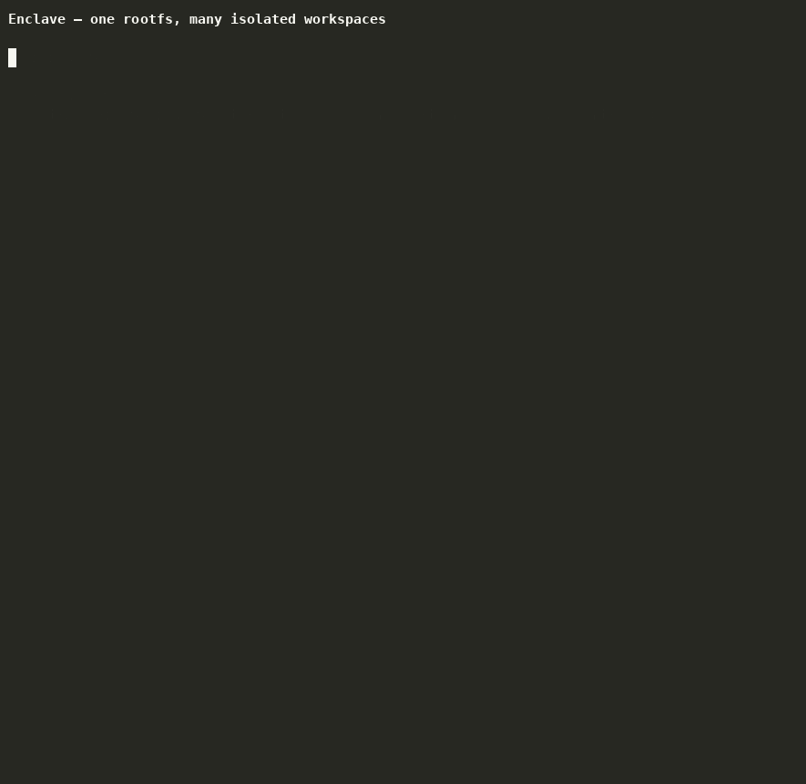

# Enclave

Run multiple isolated workspaces in one base system.



Enclave gives each workspace its own processes, mounts, network, and `/home` while
they all share one prepared root filesystem, so parallel agents or services stop
colliding without five copies of the same toolchain. It is built directly on Linux
namespaces, OverlayFS, and cgroup v2.

**Isolation for your own workloads, not a VM boundary.** Enclave is a local
development tool: it separates work from work, and it is not designed to contain
hostile code or to replace a hypervisor. See [Limitations](docs/limitations.md) for
what that means in practice.

## Why Enclave exists

I was running multiple AI agents in parallel and needed each one isolated: separate
filesystem, separate processes, no cross-contamination.

The obvious answer was Docker. But every container needed its own copy of Node,
Python, whatever the agent used. Five agents meant five redundant installs, five
images to maintain, five containers with identical tooling just to keep them apart.

What I actually wanted was simple: one environment with everything installed, split
into isolated workspaces. Global tools shared, everything else separated. That
didn't exist. So I built it.

## How it differs from Docker

| | Enclave | Docker |
|---|---|---|
| **Rootfs sharing** | All workspaces share one sandbox rootfs | Each container has its own layered rootfs |
| **Environment source** | `debootstrap` or prebuilt rootfs | OCI images pulled from registries |
| **Runtime** | Single daemon → direct `unshare`/`nsenter` | dockerd → containerd → runc |
| **Configuration** | Single `Enclavefile` (TOML) | `Dockerfile` + `docker-compose.yml` |
| **Distribution** | None — local only | Push/pull via registries |
| **Scope** | Local dev and workspace isolation | Production container orchestration |

Enclave is not a Docker replacement for shipping images, and it is not a VM or
hypervisor. It is a Linux-only local development isolation tool built directly on
namespaces, OverlayFS, and cgroup primitives.

**Linux only.** Enclave depends on Linux kernel features (`unshare`, user
namespaces, idmapped mounts, OverlayFS, `/proc` namespaces), not on any specific
distribution. macOS and Windows are not supported.

## Install

Enclave runs as **root**: it creates namespaces, mounts, cgroups, and firewall
rules, and the CLI refuses to run without privileges. Every command in the
Quickstart below is shown the way you would run it, so prefix them with `sudo` (or
run them as root). Installing also places a system binary at
`/usr/local/bin/enclave`, which is what makes `sudo enclave` work.

### Release binary (no build)

Prebuilt for x86_64 Linux, built on Ubuntu 22.04 so it runs against the older glibc
of Ubuntu 22.04 and Debian 12:

```bash
curl -fL https://github.com/ayomidelog/enclave/releases/latest/download/enclave-linux-x86_64.tar.gz -o enclave-linux-x86_64.tar.gz
curl -fL https://github.com/ayomidelog/enclave/releases/latest/download/enclave-linux-x86_64.tar.gz.sha256 -o enclave-linux-x86_64.tar.gz.sha256
sha256sum -c enclave-linux-x86_64.tar.gz.sha256
tar -xzf enclave-linux-x86_64.tar.gz
sudo install -m 0755 enclave-linux-x86_64 /usr/local/bin/enclave
enclave --version
```

### From source

The host tools listed under [Requirements](#requirements) are needed to build and to
run; on Debian or Ubuntu that is:

```bash
sudo apt-get install -y util-linux iproute2 iptables e2fsprogs
```

Then:

```bash
git clone https://github.com/ayomidelog/enclave.git
cd enclave
./scripts/install.sh
```

The installer builds the release binary with cargo and installs it to
`/usr/local/bin`. The toolchain is pinned to Rust 1.85.0 in
`rust-toolchain.toml`; [CONTRIBUTING.md](CONTRIBUTING.md) covers the development
setup, and [Requirements](#requirements) below covers the kernel side.

## Upgrading

From a checkout, `./scripts/update.sh` pulls, reinstalls, and restarts the daemon:

```bash
cd enclave
./scripts/update.sh
```

**Back up the state directory first if you are coming from 1.x.** 2.0.0 versions the
registry, and a registry written by a newer Enclave is refused rather than guessed
at, so going back to 1.x afterwards means restoring the state directory from that
backup. Stopping the daemon first is enough to make the copy quiet: a workspace
runtime outlives the daemon, so this does not interrupt anything running.

```bash
sudo enclave daemon stop
sudo cp -a /root/.local/state/enclave /root/.local/state/enclave.1.x.bak
```

2.0.0 also bounds every lifecycle wait, so a host slower than the defaults can fail a
start that used to succeed. The failure names the variable that raises it; the whole
table is in [Runtime details](docs/runtime-details.md). [CHANGELOG.md](CHANGELOG.md)
lists the rest of what changed.

## Quickstart

**Every command here needs root.** Enclave starts its daemon on first use, so there
is nothing to launch by hand.

**1. Scaffold an Enclavefile:**

```bash
sudo enclave init
```

**2. Edit it:**

```toml
[sandbox]
name = "devbox"
suite = "bookworm"

setup = [
  "apt install -y nodejs python3 cargo",
]

[workspace.api]
name = "api"
run = "node server.js"
workspace_dir = "./project"
ports = ["127.0.0.1:3001:3000/tcp"]

[workspace.shell]
name = "shell"
```

**3. Bring it up:**

```bash
sudo enclave up
```

**4. Enter a workspace:**

```bash
sudo enclave workspace enter devbox shell
```

**5. Reach a workspace service from the host when needed:**

```bash
curl http://127.0.0.1:3001
sudo enclave workspace port list devbox api
```

**6. Stream logs and inspect metrics:**

```bash
sudo enclave workspace logs api --follow
sudo enclave workspace stats api
sudo enclave stats
```

**7. Copy files to or from a running workspace when needed:**

```bash
sudo enclave workspace cp devbox shell ./notes.md ws:/home/notes.md
sudo enclave workspace cp devbox shell ws:/home/output.txt ./output.txt
```

Use the `ws:/` prefix on exactly one path to identify the workspace side. The
command streams regular files and directories through the namespace boundary; see
the [Command Reference](docs/commands.md) for copy semantics and current
limitations.

**8. Tear it down:**

```bash
sudo enclave down
```

## Requirements

- Any modern Linux distribution with kernel 5.12+ recommended for idmapped mounts
- OverlayFS support (built-in on most kernels, or `modprobe overlay`)
- Namespace support (user, PID, mount, network, UTS)
- `util-linux` with `mount` support for `X-mount.idmap` and `setpriv`
- `iproute2`
- `iptables` (either `iptables-nft` or `iptables-legacy`; auto-detected at runtime)
- `debootstrap` only if using the `debootstrap` bootstrap method (default)
- Rust toolchain for building

Enclave relies exclusively on Linux kernel features. There is no distro detection or
distro-specific branching at runtime. It runs on Debian, Ubuntu, Fedora, Arch,
Alpine, and other distributions that provide the required kernel and util-linux
features.

Workspace runtimes are hardened with user-namespace isolation, capability dropping,
read-only `/proc/sys` and `/sys` remounts, seccomp deny rules, and optional
AppArmor/SELinux hooks.

Managed workspace disk limits cover more than `/home`: when `disk_mb` is configured,
the workspace uses a quota-backed root OverlayFS layer, so writes under `/opt`,
`/var`, `/etc`, `/root`, `/home`, and workspace-private `/tmp` consume that
workspace's allocation. The shared sandbox rootfs remains the lower layer and is not
modified by those writes.

Temporary files normally survive a workspace stop when they are stored on managed
disk. To get reset-on-restart behavior, opt in per workspace:

```toml
[workspace.builder]
name = "builder"
clear_tmp_on_restart = true
```

## Bootstrap Methods

Enclave supports multiple methods for creating sandbox root filesystems:

| Method | Description | When to use |
|---|---|---|
| `debootstrap` (default) | Builds a Debian/Ubuntu rootfs locally | Standard usage on any distro with `debootstrap` installed |
| `cached_rootfs` | Copies a prebuilt minimal rootfs from the Enclave state dir | Distro-agnostic; use any rootfs (Alpine, Fedora, etc.) |

### Using `debootstrap` (default)

```bash
sudo apt-get install -y debootstrap util-linux iproute2   # Debian/Ubuntu
sudo pacman -S debootstrap util-linux iproute2             # Arch
sudo dnf install -y debootstrap util-linux iproute2        # Fedora
```

```bash
sudo enclave create mybox --suite bookworm
```

### Using a cached rootfs

Import a rootfs archive to register it in the cache index. Use `--suite` for a
suite-specific cache or `--base` for a generic cache:

```bash
sudo enclave rootfs import --suite bookworm ./bookworm-rootfs.tar.gz
# or
sudo enclave rootfs import --base ./minimal-rootfs.tar.gz
```

Then create a sandbox with:

```bash
sudo enclave create mybox --bootstrap-method cached_rootfs
```

Or set it in your `Enclavefile`:

```toml
[sandbox]
name = "devbox"
bootstrap_method = "cached_rootfs"
```

### Sharing a prebuilt rootfs

If you want Docker-like first-run speed, build the rootfs once, package it, host the
archive somewhere like GitHub Releases, then fetch it into Enclave's cache:

```bash
sudo enclave rootfs export --suite bookworm --output ./bookworm-rootfs.tar.gz
```

Publish `bookworm-rootfs.tar.gz`, then on another machine fetch it directly:

```bash
sudo enclave rootfs fetch --suite bookworm https://github.com/ayomidelog/enclave/releases/download/rootfs-bookworm-2026-06-07/bookworm-rootfs-clean-2026-06-07.tar.gz
```

You can also import a local archive without an extra `curl` step:

```bash
sudo enclave rootfs import --suite bookworm ./bookworm-rootfs.tar.gz
```

Current published example asset:

- Release page: `https://github.com/ayomidelog/enclave/releases/tag/rootfs-bookworm-2026-06-07`
- Asset: `bookworm-rootfs-clean-2026-06-07.tar.gz`

## Parallel AI agents example

A concrete Enclave setup is a small agent swarm that shares one prepared toolchain
but keeps each role isolated:

```toml
[sandbox]
name = "agents"
setup = [
  "apt install -y git nodejs python3",
]

[workspace.planner]
name = "planner"
run = "./agent.sh planner"
workspace_dir = "./agents/planner"

[workspace.coder]
name = "coder"
run = "./agent.sh coder"
workspace_dir = "./agents/coder"

[workspace.reviewer]
name = "reviewer"
run = "./agent.sh reviewer"
workspace_dir = "./agents/reviewer"
```

That gives you one sandbox rootfs with shared system packages, while each agent gets
its own `/home`, process tree, network namespace, logs, and lifecycle controls. When
`workspace_dir` points at a host project directory, Enclave mounts it through an
idmapped bind mount rather than a raw host bind.

If a workspace needs to serve a dev app back to the host browser, add
`ports = ["127.0.0.1:3001:3000/tcp"]` in the `Enclavefile` or use
`sudo enclave workspace port publish ...` after startup.

## Changing resources on a running environment

Limits are set at creation and changed afterwards with `resize`. Every target is
optional, so raising one leaves the others alone:

```bash
# A workspace: memory is a cgroup value and does not interrupt the workspace;
# a disk change restarts it the way any image resize has to.
sudo enclave workspace resize devbox api --memory-mb 2048
sudo enclave workspace resize devbox api --disk-mb 8192

# A sandbox: memory and process limits apply to a running sandbox, and
# --disk-mb sets the budget its workspaces' allocations are measured against.
sudo enclave resize devbox --memory-mb 8192
sudo enclave resize devbox --disk-mb 32768
```

Both directions work, and `--no-memory-limit` / `--no-disk-budget` remove a limit
instead of setting one. A disk allocation can be shrunk, and a shrink that the data
does not fit in is refused before anything is written, naming the smallest allocation
that would work. A sandbox's disk budget is a cap rather than a size: a sandbox rootfs
is a shared lower layer, so what it allocates is the sum of its workspaces' images,
and a workspace cannot be created or grown past the budget. Every reason a request
could be refused is checked before a running workspace is stopped for it, so a refused
resize leaves it running. A memory limit is enforced by the cgroup and by the session's
address-space limit, and both are moved together, so a raise is usable without a
restart. See the [Command Reference](docs/commands.md) for the full surface.

## Lifecycle tiers

Enclave has three ways to put a workspace away, and they preserve different things.
Which one to use is a question about what the work inside the workspace holds that is
expensive to rebuild, so each is stated in those terms.

| Command | Runtime and its PID | Memory and processes | Mounts | Files | Typical cost |
|---|---|---|---|---|---|
| `pause` / `resume` | kept | kept, and frozen while paused | kept | kept | ~0.2 s |
| `stop` / `start` | released and rebuilt | lost | released and rebuilt | kept | ~0.9 s warm |
| `destroy` | released | lost | released | removed | a stop, plus deletion |

A `pause` freezes the sandbox cgroup and leaves everything else where it is. The
processes keep their PIDs, their memory, and their mounts, so a program that was
running continues from where it was rather than starting over. That is the tier to
reach for when the workspace holds something that took minutes to build and cannot be
rebuilt cheaply, such as a loaded model, a warm cache, or a long test run in progress.

A `stop` releases the runtime and everything only the runtime held, and keeps the
workspace files. A later `start` builds a new runtime from those files, so the
processes are new processes with new PIDs and nothing in memory survives. Use it when
the workspace is between jobs.

A `destroy` does what a `stop` does and then removes the workspace files and its
record. Use it when the work inside the workspace is finished with.

The published number for each tier is measured by the benchmark under `tools/perf/`
that exercises it: `live-lifecycle.sh` for stop and start, `live-pause.sh` for pause
and resume, `live-quota.sh` for the storage tier whose workspace owns an ext4 image
rather than a directory, `live-loaded.sh` for a sandbox whose workspaces are all
busy at once, and `live-ports.sh` for the published-port lifecycle across all of
them. They are separate runs because a change to one tier is not a change to another,
and one number covering all of them would describe none of them. `live-ports.sh` is a
correctness run rather than a measurement: the workspace layer never binds a
listener, so the daemon has to be in the loop for the ports to exist at all.

## Auth Providers

Enclave supports minimal token-based auth providers for workspace access to service
credentials.

```bash
sudo enclave auth login github
sudo enclave auth list
sudo enclave auth logout github
```

### Store a provider token

```bash
sudo enclave auth login github
# paste the token at the prompt
```

Tokens are stored under the Enclave state directory, not in the workspace and not in
your shell history.

### Declare workspace auth providers

```toml
[workspace.api]
name = "api"
auth = ["github", "npm"]
env_tokens = ["ENCLAVE_TOKEN"]
```

When `env_tokens` are declared and configured, Enclave injects matching read-only
files under `/run/enclave/env/` and exports them as plain environment variables
during `workspace enter`, `workspace exec`, and runtime command execution.

### Security model

- Tokens are stored only in the Enclave state directory under `<state_dir>/auth/<provider>.token`.
- Token files are validated for strict ownership and mode (`0600`, root-owned) before use.
- Enclave does **not** read host credential sources like `~/.ssh`, `~/.gitconfig`, or other host secret files.
- Tokens are only injected for providers explicitly declared in workspace configuration.

Missing provider tokens log warnings and do not block workspace startup.

## Security at a glance

Enclave uses kernel-enforced UID authentication on its Unix socket, a UID-based
policy engine, per-workspace user/PID/mount/network/UTS namespaces, idmapped `/home`
mounts, capability dropping, read-only `/proc/sys` and `/sys` remounts, masked
kernel-info proc/sys paths, host-local and metadata network blocks, and a seccomp
deny list for runtime hardening.

It is designed for local development isolation, not for hostile multi-tenant
workloads or VM-grade isolation. For the full threat model, setup-command caveats,
and current constraints, see [docs/security.md](docs/security.md) and
[docs/limitations.md](docs/limitations.md).

## Runtime recovery

Enclave protects each configured state directory with an exclusive daemon lock. If a
daemon or runtime is interrupted, run diagnostics before manually removing state:

```bash
sudo enclave doctor
sudo enclave doctor --repair
```

`doctor --repair` reconciles stale registry records, workspace namespace references,
mounts, and safe orphaned files, and resolves an interrupted lifecycle transition
rather than only reporting it: an interrupted stop is completed and an interrupted
start is rolled back. Destructive commands require a running daemon by default; use
`sudo enclave daemon start` or opt in for one command with `--start-daemon`.

Every lifecycle operation runs under one operation id. Mutating commands print it, a
failure names it, and the id identifies the operation's durable record under the
state directory's `operations/` directory, its log lines, and its phase timings.
When a command reports a failure, that id is how to find what it did.

## Snapshot Archives

Workspace snapshots are stored locally as copy-based directories, and Enclave can
package and restore them as portable archives:

```bash
sudo enclave snapshot export mybox ws1 snap1 --output ./ws1-snap1.tar.gz
sudo enclave snapshot import mybox ws1 --name imported-snap ./ws1-snap1.tar.gz
```

That lets you move a workspace snapshot between hosts or keep an archive copy without
changing the normal local snapshot workflow.

## Latest Verified Lifecycle Timing

On the bounded eight-workspace cached-rootfs benchmark (bootstrap preparation
excluded), as the median of seven consecutive runs taken with the release binary at
a one-minute load average of 3.0 on four CPUs:

- cold workspace boot: `2.14s`
- cold shutdown: `1.52s`
- warm workspace boot: `1.95s`
- warm shutdown: `0.75s`

Each release carries a full p50/p95/p99 report taken with the binary it ships, along
with the host it was measured on, in
[docs/lifecycle-report.md](docs/lifecycle-report.md). Regenerate it with
`ENCLAVE_LIVE_ITERATIONS=12 ./tools/perf/lifecycle-report.sh`, which needs a
privileged host and a cached rootfs. The committed report agrees with the medians
above: warm boot p50 `1.92s` and warm shutdown p50 `0.73s` over twelve cycles.

The validation host is shared with other work, so the spread is wide and the load
matters more than the tree does. The report records the load average and the CPU
count it was taken under for exactly that reason. On the seven-run measurement the
warm boot ranged 1.63–4.13s and warm shutdown 0.70–0.93s; the medians are the number
to compare, and the range is what a shared host does to them. Reproduce them with:

```bash
ENCLAVE_UP_WORKERS=1 ENCLAVE_CLEANUP_WORKERS=4 ./tools/perf/live-lifecycle.sh
```

The benchmark reuses a local cached rootfs and does not download bootstrap packages.

The run pins one up worker so its numbers are comparable between releases. The
daemon's own default is one start per core, so a plain `enclave up` on this host is
faster than the number above: the pinned run is a floor, and it is the one the range
describes. A sweep of the worker count found no reason to change that default. On
this four-CPU host the eight-workspace fixture booted in 1.54s at four workers, 1.40s
at eight, and 1.65s at sixteen, each the median of three runs, which is inside the
spread of the fixture itself.

These numbers are all for the stop-and-start tier. Pausing a running sandbox is the
fast tier, and it keeps the processes and their memory; see the lifecycle tiers
section above.

## Development

```bash
make check          # cargo fmt --check and cargo check
make clippy         # cargo clippy --all-targets -- -D warnings
make test-unit      # the unit suite, no privileges needed
sudo make test-integration   # namespaces, mounts, cgroups, and firewall rules
sudo make test-stress        # the churn and concurrency stress suites
```

The integration and stress suites are marked `#[ignore]`, because they need root and
a host that can create namespaces, mounts, and loop devices. `make test` runs
everything, so it needs the same privileges. Each integration test builds its own
state directory and its own cached rootfs, so they do not touch a sandbox that is
already running; `tools/perf/live-*.sh` follow the same rule for the live lifecycle
benchmarks. See [CONTRIBUTING.md](CONTRIBUTING.md) for the conventions.

## Documentation

- [Architecture](docs/architecture.md)
- [Runtime Details](docs/runtime-details.md)
- [Storage Layout](docs/storage.md)
- [Command Reference](docs/commands.md)
- [Enclavefile Reference](docs/enclavefile.md)
- [Configuration](docs/configuration.md)
- [Security](docs/security.md)
- [Limitations](docs/limitations.md)
- [Roadmap](docs/roadmap.md)
- [Lifecycle Latency Report](docs/lifecycle-report.md)
- [Performance Harness](tools/perf/README.md)
- [Contributing](CONTRIBUTING.md)

## Examples

The [Quickstart](#quickstart) section above covers the core workflow. For command
details see the [Command Reference](docs/commands.md). For Enclavefile options see
the [Enclavefile Reference](docs/enclavefile.md). For runtime behavior and
networking details see [Runtime Details](docs/runtime-details.md).

## Tested Distributions

Enclave is validated across the following Linux distributions:

| Distribution | Kernel | Status |
|---|---|---|
| Debian 12 (Bookworm) | 6.1+ | ✅ Supported |
| Ubuntu 22.04+ | 5.15+ | ✅ Supported |
| Fedora 38+ | 6.2+ | ✅ Supported |
| Arch Linux | rolling | ✅ Supported |
| Alpine Linux 3.18+ | 6.1+ | ✅ Supported |

Any Linux distribution with a modern kernel, OverlayFS support, user namespaces, and
idmapped mount support should work. If you encounter issues on an unlisted distro,
please open an issue.
