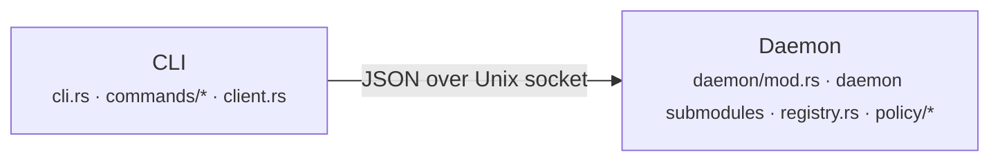
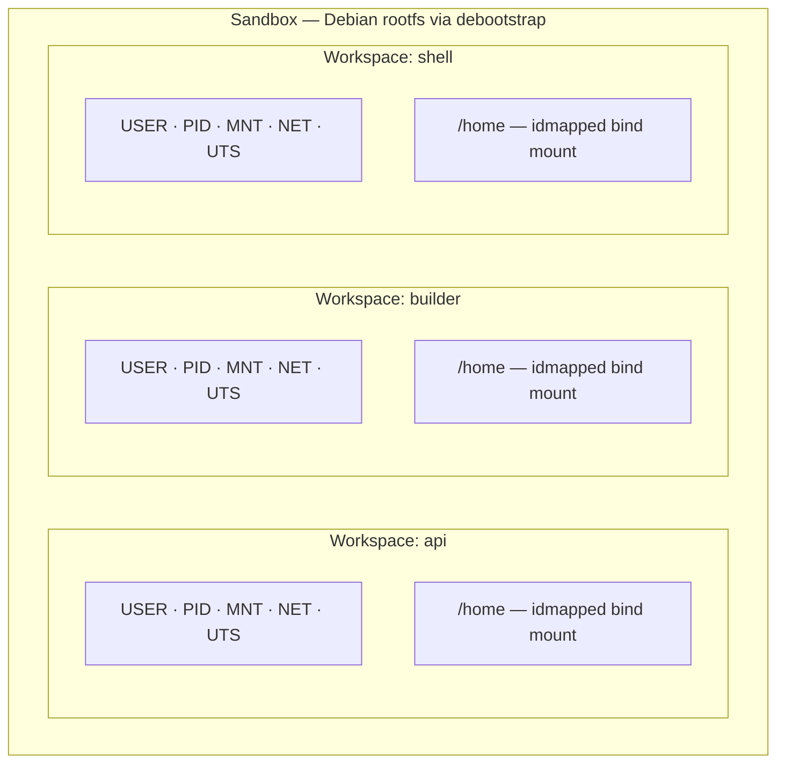
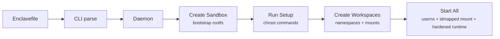
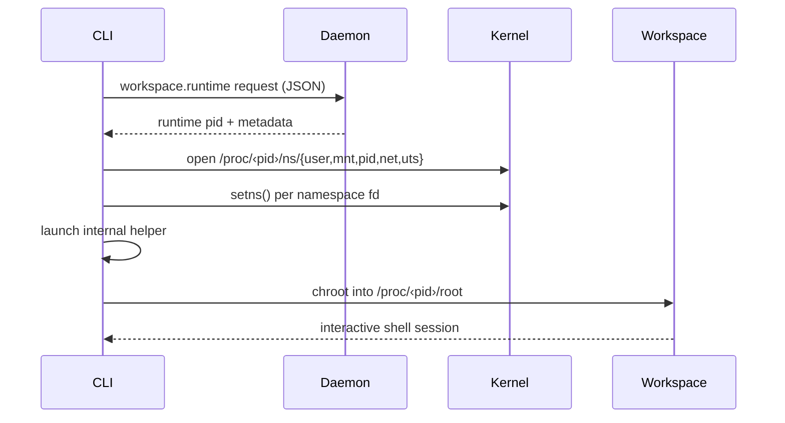
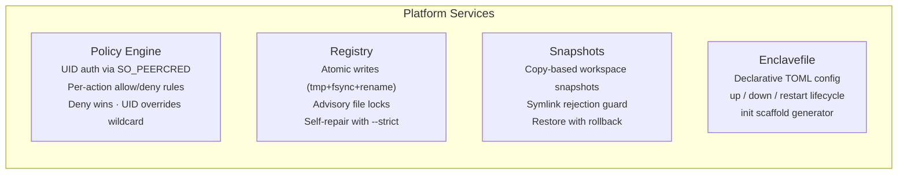

# Architecture

## Overview

Enclave uses a client-daemon architecture where the CLI communicates with a background daemon over a Unix domain socket. The daemon is the single authority for all sandbox and workspace lifecycle operations, policy enforcement, and state management.

## CLI / Daemon Communication

- **CLI** serializes commands as JSON requests: `{ "action": "...", "params": { ... } }`
- **Daemon** processes them and responds: `{ "ok": bool, "result"?: ..., "error"?: "..." }`
- For `workspace enter` and `workspace exec`, the daemon returns runtime metadata and the CLI launches an internal helper that joins the runtime namespaces directly. Stdout/stderr still stream in real-time without passing through the daemon.

## Isolation Model

Enclave provides two-level isolation: **sandboxes** contain one or more **workspaces**, each running in its own set of Linux namespaces.

- **Sandbox rootfs** is a full filesystem bootstrapped by Enclave (`debootstrap` or `cached_rootfs`), shared read-only across all workspaces in that sandbox.
- **Each workspace** runs in isolated user, PID, mount, network, and UTS namespaces via `unshare`.
- **Workspace filesystem** is mounted into `/home` as an idmapped bind mount inside the sandbox root.
- **Optional host workspace path** can be configured per workspace in the Enclavefile (`workspace_dir = "./project"` or legacy `path = "./project"` / `"/absolute/host/path"`). Relative paths are resolved from the Enclavefile directory. When set, that host directory is mounted at `/home` through an idmapped bind mount instead of the default Enclave-managed workspace directory.
- **Optional loopback port publishing** is daemon-managed. Declared workspace ports are bound on `127.0.0.1` and proxied to the workspace IP only while the workspace is running.
- **Resource limits** (CPU time, memory, max processes, open files) are enforced per workspace using POSIX `setrlimit`/`prlimit`.
- **Runtime hardening** remounts `/proc/sys` and `/sys` read-only, drops capabilities, and applies a seccomp deny list after bootstrap.

## Enclave Up Lifecycle

When you run `enclave up`, the following sequence occurs:

1. CLI reads and parses the `Enclavefile` in the current directory.
2. Sends `sandbox.create` to the daemon — bootstraps the rootfs using the selected method.
3. Sends `sandbox.exec_setup` for each setup command — runs inside the sandbox via `chroot`.
4. Sends `workspace.create` for each `[workspace.*]` block — creates namespace isolation + mounts.
5. Sends `workspace.start` — executes the `run` command (if defined) inside the workspace.

- Setup commands run during sandbox creation and are re-run on later `enclave up` / `enclave restart` calls so Enclavefile changes can be applied to an existing sandbox.
- Re-running `enclave up` when the sandbox exists skips sandbox creation, re-applies setup commands, and starts workspaces.
- `--rebuild` forces sandbox recreation and reruns setup from scratch.

## Namespace Handoff (workspace enter / exec)

Both `workspace enter` and `workspace exec` use a direct namespace handoff through an internal CLI helper. The daemon returns runtime metadata, then the CLI launches a hidden internal command that opens `/proc/<pid>/ns/*`, calls `setns()`, and executes directly inside the workspace namespaces. This means output streams in real-time and the daemon does not proxy process stdio.

The sequence for `workspace enter`:

`workspace exec` follows the same internal-helper + `setns()` path, except it runs a one-shot command and streams its stdout/stderr directly to the terminal instead of opening an interactive shell.

## Platform Services

## State Layout

For the on-disk layout of the state directory, rootfs cache, workspace overlay directories, snapshots, and auth token storage, see [storage.md](storage.md).

## Source Module Map

| Module | Purpose |
|--------|---------|
| `src/cli.rs` | Clap argument definitions |
| `src/commands/*` | CLI command handlers (sandbox, workspace, enclavefile, daemon, ps) |
| `src/commands/workspace/enter.rs` | `workspace enter` and `workspace exec` frontend that launches the internal runtime helper |
| `src/commands/internal.rs` | Hidden internal commands for hardened session loops and runtime namespace entry |
| `src/client.rs` | Unix socket JSON client |
| `src/daemon/mod.rs` | Daemon main loop, connection handling |
| `src/daemon/dispatch.rs` | Action routing and parameter extraction |
| `src/daemon/rate_limiter.rs` | Per-UID request rate limiting |
| `src/registry.rs` | Atomic JSON state persistence with file locking |
| `src/policy/*` | Policy engine (allow/deny rules, UID matching) |
| `src/sandbox/*` | Sandbox lifecycle (create, start, stop, destroy) |
| `src/workspace/*` | Workspace lifecycle, sessions, snapshots, process status |
| `src/network/*` | Network namespace setup (bridge, isolated veth ports, NAT, IPAM, DNS, loopback port publishing, host-network cache) |
| `src/enclavefile.rs` | Enclavefile TOML parsing and scaffolding |
| `src/config.rs` | Configuration file loading |
| `src/doctor.rs` | System diagnostics (registry, mounts, cgroups, runtime state) |
| `src/paths.rs` | Default path helpers (socket, state dir, pid file) |
| `src/logging/` | Tracing/tracing-subscriber setup (ENCLAVE_LOG env filter) |
| `src/fsutil.rs` | Atomic writes, file locking, path validation, slugify |
| `src/protocol.rs` | JSON request/response wire format |
| `src/workspace/session/mod.rs` | Workspace session lifecycle, sandbox-local session-helper cache, namespace handoff, and runtime bootstrap |
| `src/workspace/session/security.rs` | Capability dropping, read-only remounts, and seccomp filter setup |
| `src/workspace/session/userns.rs` | Subordinate UID/GID range detection for user namespace planning |
| `src/workspace/session/idmap.rs` | Idmapped mount option generation for workspace source mounts |
