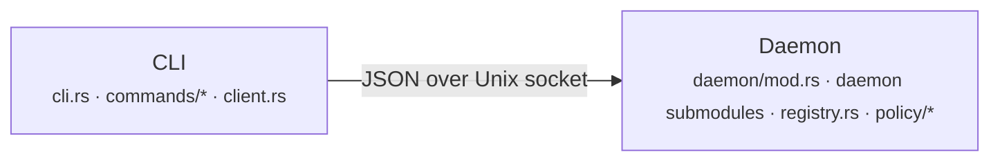
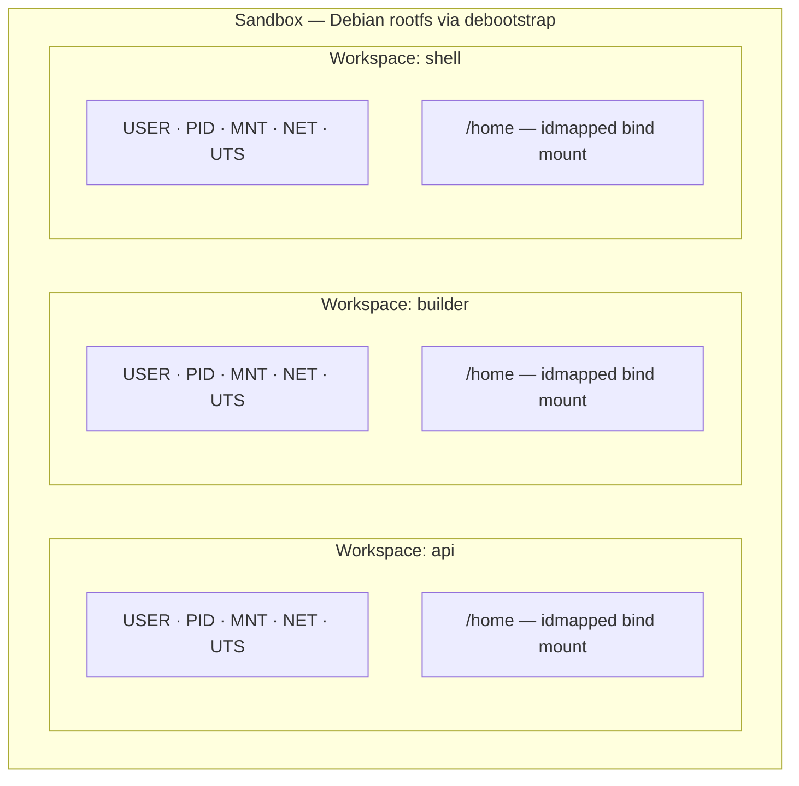
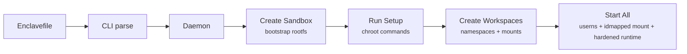
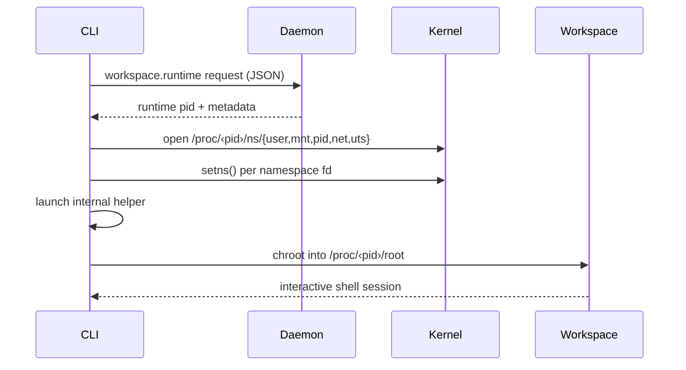
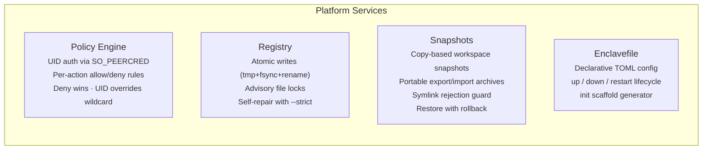

# Architecture

## Overview

Enclave uses a client-daemon architecture where the CLI communicates with a background daemon over a Unix domain socket. The daemon is the single authority for all sandbox and workspace lifecycle operations, policy enforcement, and state management.

## CLI / Daemon Communication

```mermaid
graph LR
    CLI["CLI<br/><small>cli.rs · commands/* · client.rs</small>"]
    Daemon["Daemon<br/><small>daemon/mod.rs · daemon submodules · registry.rs · policy/*</small>"]

    CLI -->|"JSON over Unix socket"| Daemon
```

- **CLI** serializes commands as JSON requests: `{ "action": "...", "params": { ... } }`
- **Daemon** processes them and responds: `{ "ok": bool, "result"?: ..., "error"?: "...", "code"?: "...", "operation_id": "..." }`
- Every failure carries a stable machine-readable `code` beside the human `error` message, so a client can tell a missing sandbox from a conflict, an unsupported host, a timeout, or a cleanup that could not release every resource without matching on wording. The code is attached where the failure is raised and carried through the error chain; a failure nobody categorized is `internal`. Successful responses omit it.
- The daemon uses separate bounded control and transfer worker queues so long-running `workspace.cp` requests cannot consume every control worker.
- Worker counts are bounded and benchmark-configurable with `ENCLAVE_CONTROL_WORKERS` and `ENCLAVE_TRANSFER_WORKERS`; default production values remain 6 and 2.
- For interactive `workspace enter`, the CLI launches an internal helper that joins the runtime namespaces directly. Daemon-managed `workspace exec` uses a persistent per-runtime helper: validated namespace descriptors and a pidfd are inherited once, while each command is authenticated and revalidated over a private Unix socket. Stdout/stderr remain outside the daemon JSON control response.
- Repeated daemon-managed namespace operations reuse an identity-checked descriptor cache keyed by runtime PID and start time. Cached descriptors are duplicated only for the helper process and invalidated when namespace identities change.
- Workspace creation and Enclavefile startup use bounded fan-out for independent work, while registry commits and run-command ordering remain deterministic.
- Enclavefile workspace startup uses one bounded `workspace.start_many` daemon request and returns structured per-workspace results; partial success is explicit so callers can report failed items without losing successful starts.
- Sandbox pause/resume freezes the sandbox cgroup as one lifecycle boundary, preserves namespaces and mounts, and restores published ports best-effort without stopping workspaces when a host port is unavailable.
- Sandbox shutdown sends process termination and starts independent network cleanup concurrently; storage unmounting waits for runtime termination and propagates cleanup failures for recovery.
- Sandboxes created from a cached rootfs mount their rootfs as an OverlayFS over the shared cache directory, so no rootfs tree is copied per sandbox; the cache is a lower layer only and every sandbox keeps its own writable upper and work directories.
- Managed workspaces with `disk_mb` mount a per-workspace OverlayFS root before `pivot_root`; the shared sandbox rootfs is the lower layer and the quota-backed workspace image stores the upper/work directories, making root-level copy-on-write data subject to the workspace quota.
- The optional `clear_tmp_on_restart` workspace setting resets managed `/tmp` only after the runtime and its storage mounts are confirmed stopped; failed unmounts leave data intact.
- Batch workspace wipe takes one registry snapshot, performs independent cleanup through the bounded cleanup pool, and commits each confirmed deletion separately so a later failure cannot retain already-cleaned records.
- Registry mutations carry a monotonic generation counter used as durable evidence that a resource snapshot is not being committed over a newer lifecycle change.
- Host bridge/NAT initialization has a daemon-wide mutex; workspace-specific veth, DNS, and namespace setup remains outside that critical section.
- Setup caching is an explicit CLI opt-in. The daemon stores per-command completion markers under the sandbox runtime directory and only writes them after successful setup execution.
- For `workspace cp`, the daemon uses the same namespace-entry plumbing to run transfer helpers in the workspace. Regular host files use a direct `sendfile` stream into a namespace-local receiver; host-to-workspace directories use a Rust-controlled tar stream and workspace-to-host data uses Rust-validated extraction. Both directions stage output before an atomic commit; payloads never enter the JSON control protocol.
- Host-to-workspace directory archives are produced by a single Rust traversal that validates entry types while writing the stream; workspace-to-host extraction retains independent archive validation before its atomic commit.

## Isolation Model

Enclave provides two-level isolation: **sandboxes** contain one or more **workspaces**, each running in its own set of Linux namespaces.

```mermaid
graph TB
    subgraph Sandbox["Sandbox — Debian rootfs via debootstrap"]
        subgraph WS1["Workspace: api"]
            W1_NS["USER · PID · MNT · NET · UTS"]
            W1_WS["/home — idmapped bind mount"]
        end
        subgraph WS2["Workspace: builder"]
            W2_NS["USER · PID · MNT · NET · UTS"]
            W2_WS["/home — idmapped bind mount"]
        end
        subgraph WS3["Workspace: shell"]
            W3_NS["USER · PID · MNT · NET · UTS"]
            W3_WS["/home — idmapped bind mount"]
        end
    end
```

- **Sandbox rootfs** is a full filesystem bootstrapped by Enclave (`debootstrap` or `cached_rootfs`), shared read-only across all workspaces in that sandbox.
- **Each workspace** runs in isolated user, PID, mount, network, and UTS namespaces via `unshare`.
- **Workspace filesystem** is mounted into `/home` as an idmapped bind mount inside the sandbox root.
- **Optional host workspace path** can be configured per workspace in the Enclavefile (`workspace_dir = "./project"` or legacy `path = "./project"` / `"/absolute/host/path"`). Relative paths are resolved from the Enclavefile directory. When set, that host directory is mounted at `/home` through an idmapped bind mount instead of the default Enclave-managed workspace directory.
- **Optional loopback port publishing** is daemon-managed. Declared workspace ports are bound on `127.0.0.1` and proxied to the workspace IP only while the workspace is running.
- **Resource limits** (CPU time, memory, max processes, open files) are enforced per workspace using POSIX `setrlimit`/`prlimit`.
- **Runtime hardening** remounts `/proc/sys` and `/sys` read-only, drops capabilities, and applies a seccomp deny list after bootstrap.

## Enclave Up Lifecycle

When you run `enclave up`, the following sequence occurs:

```mermaid
flowchart LR
    A["Enclavefile"] --> B["CLI parse"]
    B --> C["Daemon"]
    C --> D["Create Sandbox<br/><small>bootstrap rootfs</small>"]
    D --> E["Run Setup<br/><small>chroot commands</small>"]
    E --> F["Create Workspaces<br/><small>namespaces + mounts</small>"]
    F --> G["Start All<br/><small>userns + idmapped mount + hardened runtime</small>"]
```

1. CLI reads and parses the `Enclavefile` in the current directory.
2. Sends `sandbox.create` to the daemon — bootstraps the rootfs using the selected method.
3. Sends `sandbox.exec_setup` for each setup command — runs inside the sandbox via `chroot`.
4. Sends `workspace.create` for each `[workspace.*]` block — creates namespace isolation + mounts.
5. Sends one bounded `workspace.start_many` request — starts workspace runtimes concurrently and launches configured `run` commands detached inside each workspace cgroup.

- Setup commands run during sandbox creation and are re-run on later `enclave up` / `enclave restart` calls so Enclavefile changes can be applied to an existing sandbox.
- Re-running `enclave up` when the sandbox exists skips sandbox creation, re-applies setup commands, and starts workspaces.
- `--rebuild` forces sandbox recreation and reruns setup from scratch.

## Lifecycle State And Recovery

A lifecycle operation is a durable transaction, not a sequence of calls. Each one
runs under an operation id, records its target and current phase in a journal file
under `<state_dir>/operations/`, and reports that id back to the caller. The id ties
the command a user ran to the journal record, the log lines, and the phase timings
for the same operation.

The registry records transitional states so a crash is never ambiguous:

| Resource | States |
|---|---|
| Sandbox | `starting`, `running`, `paused`, `stopping`, `stopped` |
| Workspace | `starting`, `running`, `stopping`, `stopped` |

A transitional state means an operation is in flight and the recorded runtime
identity may not be final yet. Nothing else may start a competing operation on that
resource, and a daemon that starts and finds one resolves it deterministically: an
interrupted start is rolled back and an interrupted stop is completed. Neither is
resumed, because resuming a half-started runtime would adopt a process whose identity
the record does not prove.

The one case that completes rather than rolls back is the one where the record does
prove it. A launch writes the workspace's own record — status, runtime pid, start
time, and namespace references — before it commits the registry, so a daemon killed
between those two leaves the on-disk copy saying `running` while the registry still
says `starting`. Repair adopts the on-disk copy, which is the precedence rule below,
and the status is then no longer transitional, so recovery finds a runtime whose
recorded identity matches and keeps it. The start is complete, not half-finished.

Cleanup is proved rather than asserted. A stop captures the resources the workspace
owns before it signals anything, then verifies the host afterwards — runtime pid and
start time, cgroup, mounts, loop device, veth interface, firewall rules, namespace
reference files, and files — and refuses to record `stopped` while any of them is
still held. A destroy runs the same check before it removes the workspace directory.
The result is that a recorded state is evidence about the host, not a claim about
what the code intended to do.

Recovery follows the same rule from the other side. A workspace whose record says
`running` but whose runtime is dead has the resources that runtime owned released
before the record is cleared, because the record is the only description of them.
Nothing is deleted through a mount Enclave did not create, and nothing is signalled
without proof of identity: a pid is only acted on when its start time, and where it
exists its namespace inode, still match what was recorded.

One case is worth naming because it is easy to get wrong. A workspace records its
runtime pid only when a launch commits, so there is a window in which a session is
running and no record names it. A stop that arrives in that window, and a launch that
fails in it, both find the session by the pid file it wrote or by its own command
line, and end it. Without that, the session keeps running with its namespaces, its
mounts, and its private `/tmp` after the record has been rewritten as stopped, and
nothing on the host describes it any more.

## Namespace Handoff (workspace enter / exec)

Both `workspace enter` and `workspace exec` use a direct namespace handoff through an internal CLI helper. The daemon returns runtime metadata, then the CLI launches a hidden internal command that uses identity-checked cached descriptors when available, calls `setns()`, and executes directly inside the workspace namespaces. Descriptors are reopened when the PID start time or namespace identities change. This means output streams in real-time and the daemon does not proxy process stdio.

The sequence for `workspace enter`:

```mermaid
sequenceDiagram
    participant CLI
    participant Daemon
    participant Kernel
    participant Workspace

    CLI->>Daemon: workspace.runtime request (JSON)
    Daemon-->>CLI: runtime pid + metadata
    CLI->>Kernel: open /proc/‹pid›/ns/{user,mnt,pid,net,uts}
    CLI->>Kernel: setns() per namespace fd
    CLI->>CLI: launch internal helper
    CLI->>Workspace: chroot into /proc/‹pid›/root
    Workspace-->>CLI: interactive shell session
```

`workspace exec` follows the same internal-helper + `setns()` path, except it runs a one-shot command and streams its stdout/stderr directly to the terminal instead of opening an interactive shell.

## Platform Services

```mermaid
graph LR
    subgraph Services["Platform Services"]
        PE["Policy Engine<br/><small>UID auth via SO_PEERCRED<br/>Per-action allow/deny rules<br/>Deny wins · UID overrides wildcard</small>"]
        RG["Registry<br/><small>Atomic writes (tmp+fsync+rename)<br/>Advisory file locks<br/>Self-repair with --strict</small>"]
        SN["Snapshots<br/><small>Copy-based workspace snapshots<br/>Portable export/import archives<br/>Symlink rejection guard<br/>Restore with rollback</small>"]
        EF["Enclavefile<br/><small>Declarative TOML config<br/>up / down / restart lifecycle<br/>init scaffold generator</small>"]
    end
```

## State Layout

For the on-disk layout of the state directory, rootfs cache, workspace overlay directories, snapshots, and auth token storage, see [storage.md](storage.md).

## Source Module Map

| Module | Purpose |
|--------|---------|
| `src/cli/` | Clap argument definitions |
| `src/commands/` | CLI command handlers (sandbox, workspace, enclavefile, daemon, ps, rootfs, policy) |
| `src/commands/workspace/enter.rs` | `workspace enter` and `workspace exec` frontend that launches the internal runtime helper |
| `src/commands/internal/` | Hidden internal commands for hardened session loops, runtime namespace entry, and persistent command helpers |
| `src/client.rs` | Unix socket JSON client |
| `src/daemon/mod.rs` | Daemon main loop, shutdown, and connection handling |
| `src/daemon/dispatch/` | Action routing and parameter extraction |
| `src/daemon/workers/` | Bounded control and transfer worker pools with separate quality-of-service queues |
| `src/daemon/leases.rs` | Per-sandbox lifecycle serialization |
| `src/daemon/active_operations.rs` | The lifecycle operations in flight, named for shutdown reporting |
| `src/daemon/state_lock.rs` | Exclusive state-directory daemon ownership lock and metadata record |
| `src/daemon/rate_limiter.rs` | Per-UID request rate limiting |
| `src/registry/` | Atomic JSON state persistence, file locking, schema migration, and repair |
| `src/operation/` | The lifecycle journal: operation ids, records, phases, and retention |
| `src/policy/` | Policy engine (allow/deny rules, UID matching) |
| `src/sandbox/` | Sandbox lifecycle, rootfs bootstrap and cache, and the sandbox cgroup |
| `src/workspace/` | Workspace lifecycle, sessions, storage, snapshots, cleanup certificates, and process status |
| `src/workspace/control/` | The workspace lifecycle state machine: start, stop, destroy, resize, and reconcile |
| `src/workspace/certificate/` | The verified host-state record a stop and destroy produce |
| `src/workspace/inventory/` | The resources a workspace owns, captured before cleanup and compared after |
| `src/workspace/session/` | Workspace session launch, readiness, namespace handoff, and runtime discovery |
| `src/workspace/storage/` | Managed and quota-backed workspace storage, mounts, and unmount verification |
| `src/network/` | Network namespace setup (bridge, isolated veth ports, NAT, IPAM, DNS, loopback port publishing) |
| `src/doctor/` | System diagnostics: registry, mounts, cgroups, networking, loop devices, orphan runtimes, the journal, and host capabilities |
| `src/hostcmd/` | Every host command, run under a bounded deadline with structured errors |
| `src/perf/` | Phase timers, counters, and histograms for the lifecycle |
| `src/deadlines.rs` | The configurable, bounded lifecycle deadlines |
| `src/error.rs` | Machine-readable error codes carried through the error chain |
| `src/enclavefile.rs` | Enclavefile TOML parsing and scaffolding |
| `src/config.rs` | Configuration file loading |
| `src/paths.rs` | Default path helpers (socket, state dir, pid file) |
| `src/logging/` | Tracing/tracing-subscriber setup (ENCLAVE_LOG env filter) |
| `src/fsutil/` | Atomic writes, file locking, path validation, and mountinfo parsing |
| `src/protocol.rs` | JSON request/response wire format |
